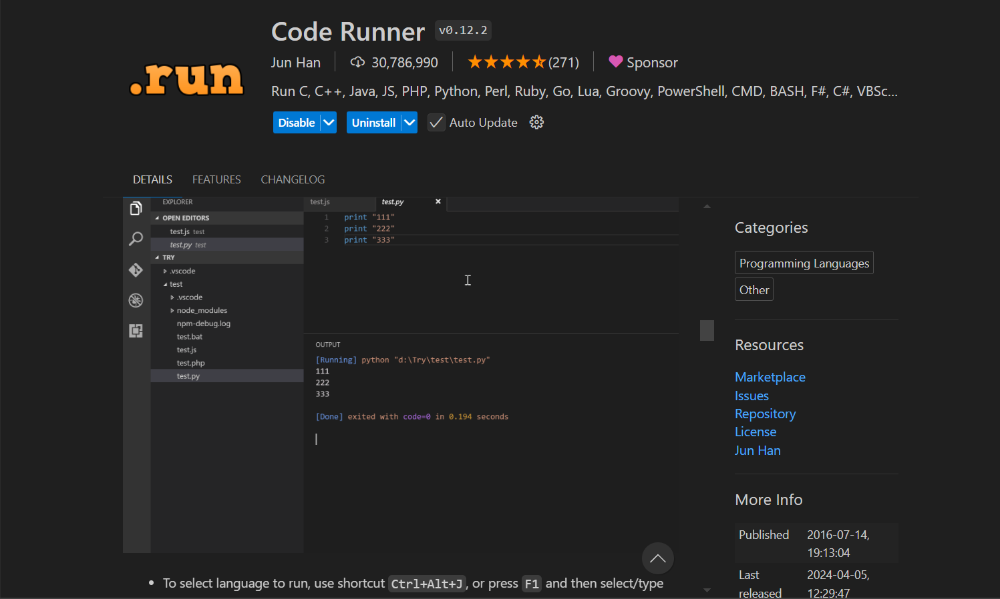
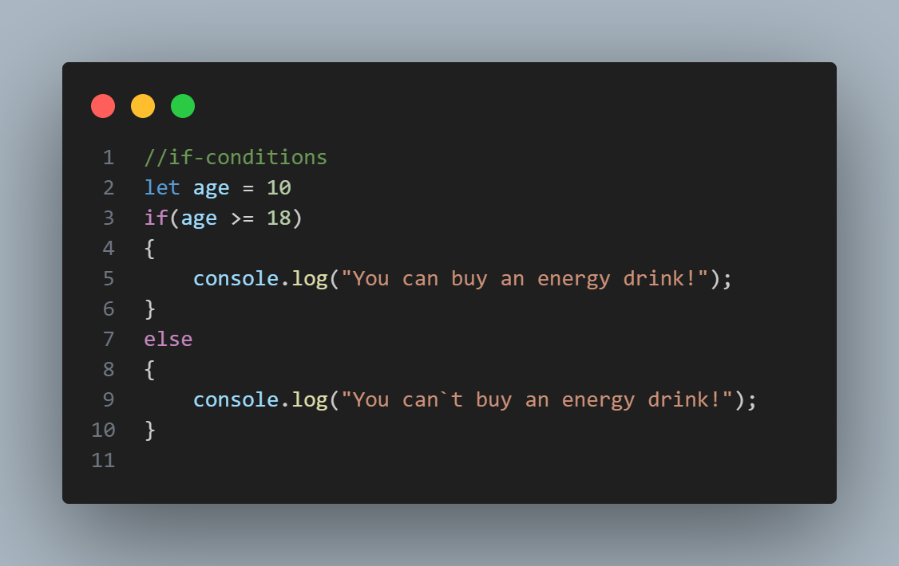

# Hello js

```
console.log("Hello js");
```
## дар файли readme зерин дар бораи забони барномасозии JS каме навистам 
# Забони барномасозии Js соли 1995 аз тарафи Brandan Eich ихтироъ шуд.

# Номи аввалини JS Mocha буд ва баъдан бa (Livescript) номгузори шуд. Соли 1996 забони Livescript ба Javascript номгузори шуд аз он сабабе ки дар соли 1996 забони барномасозии Java бисёр машғул буд ва аз он свбвб онро бо номи Javascript номгузори карданд.

# Боз дар забони барномасозии Js ECMAscript ҳаст ки стандарти структураи забонро медиҳад. Ва боз бо ecmascript ҳама навгониҳоро мебароранд.
# Аз ҳама навгонии калоне ки дар забони js баровардаги буданд соли 2015 бароварда буданд ки дар ин навгони бисёри багҳоро фикс карда буданд ва фичаҳои нав дароварда буданд.


# Чвнд роҳи run кардани код ҳаст
- бо консоли браузер
- бо командаи node."namefile.js"
- бо экстешиони code Runner



# Дар  Js 3 - роҳи сохтани variable ҳаст 
- var 
- let 
- const

# var - дар версияҳои куҳнаи JS истифода бурда мешуд.
# Ва Баъдан дар update - и калоне соли 2015 буд дуто калимаҳои махсус баровардан:
# let & const
# let мисли var истифода бурда мешавад.
# const - барои значенияҳои махсус истифода бурда мешавад. Example: Pi = 3.14 G=9.8 ва агар мо ҳамин маълумотҳоро иваз кардани бошем иваз карда намешавад.


#  Дар Js маълумотҳо 8 намуд мешаванд ва ба 2 - гуруҳ ҷудо мешаванд: Primitive & Object
# Primitive - types 
- NUumber
- String 
- Boolean
- Undefined
- Null
- Symbol
- Bigint

# object - types
- object iteral 
- Arrays
- Function
- Many more...
---
# if-condition for Js


# Ташаккури зиёд бештар маълумотҳоро дар линки зерин [link](https://www.canva.com/design/DAGVRMGhGek/BBk6e7-80rD60KOpBBjCUg/view?utm_content=DAGVRMGhGek&utm_campaign=designshare&utm_medium=link&utm_source=editor#5)

